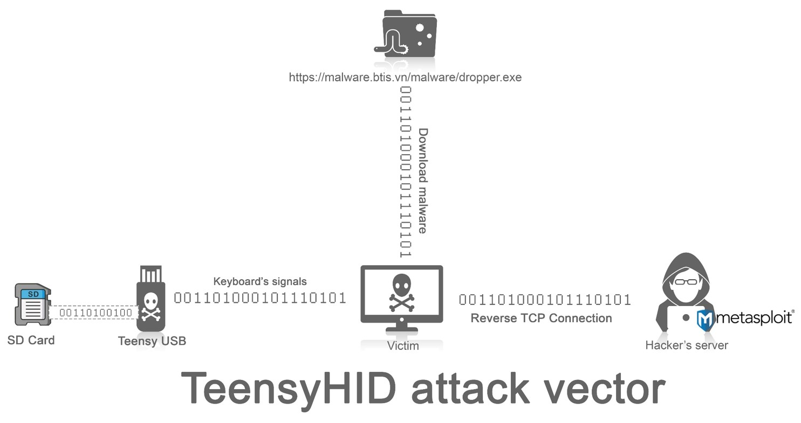
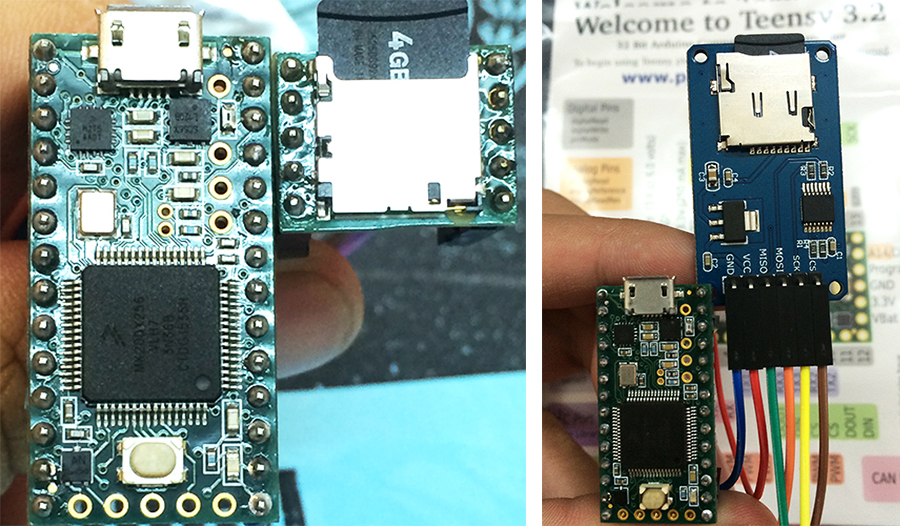

### Teensy USB Development Board
Teensy là một mạch tích hợp sử dụng vi xử lý trên nền tảng USB, thiết kế với kích thước nhỏ và có thể phát triển mở rộng thành nhiều tính năng khác nhau. Tất cả quá trình biên dịch, nạp chip và thực thi mã đều thông qua kết nối USB.

[CÀ PHÊ BẢO MẬT LẦN THỨ 14 - TeensyHID attack vector - A new/ old attack vector](http://vnisahcm.org.vn/vi-vn/hoat-%C4%91ong-chi-hoi/vnisa-thu-moi-tham-du-buoi-sinh-hoat-ca-phe-bao-ma.aspx)

Hình: Teensy HID Attack Vector

Hình: Teensy HID + SD Adaptor